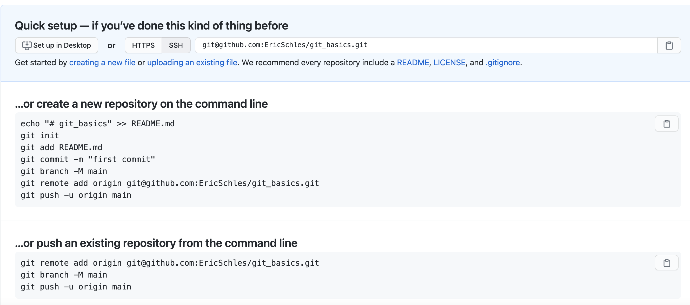

# Git basics

Table of Contents:

* How to set up a repo on github
* How to set up a repo on bitbucket
* What are ssh keys
* How to set up ssh keys
* Pointers and data structures using pointers:
	* A linked list
	* A binary tree
* How to push code
* How to pull code
	* How to keep up to date with a remote
* How to debug using git
* How to rebase
* How to fix merge conflicts
* Branch best practice
* Documentation of commits (conventional commits)
* How to open a pull request
* Pull request review

## How to set up a github repo

Setting up a github repo is fairly straight forward.  But here is a [guide](https://docs.github.com/en/get-started/quickstart/create-a-repo) in case you need some help.

Once you set up the repo you'll see a screen like this:



## How to set up a bitbucket repo

Setting up a bitbucket repo is almost exactly equivalent.  I'll leave it as an exercise to do this.  Here is a [guide](https://support.atlassian.com/bitbucket-cloud/docs/create-a-git-repository/).

## What are ssh keys

ssh keys are a way to do public key encryption.  You generate a public and private key.  With public key encryption, you share your public keys with external partners.  Public keys are used to encrypt information.  To decrypt you use your private key.  

Note: You should _never_ share your private keys.

References:

* [public keys](https://en.wikipedia.org/wiki/Public-key_cryptography)
* [ssh](https://jumpcloud.com/blog/what-are-ssh-keys)

## How to set up ssh keys

Here is a [tutorial](https://docs.github.com/en/github/authenticating-to-github/connecting-to-github-with-ssh) of how to set up ssh keys.

As an exercise, figure out how to add these to bitbucket.

## Pointers

## How to work with git cli

Typically you'll want to keep your code up to date with the main branch by regularly pulling in changes to main (typically I do this at the start and end of the work day).

### git push

```bash
git add NAME_OF_FILE
git commit -m "
what: adding some code
why: to add this feature
to do: write some tests
"
git push
```

### git pull

```bash
git checkout main
git pull
git branch -b updating_main
```

### git rebase

```bash
git checkout feature_branch
git merge main
```

OR 

```bash
git checkout feature
git rebase -i main
```

interactive mode requires strong understanding of vim/vi

### merge conflicts

https://www.atlassian.com/git/tutorials/using-branches/merge-conflicts

Reference:

https://www.atlassian.com/git/tutorials/learn-git-with-bitbucket-cloud

### git bisect

https://www.metaltoad.com/blog/beginners-guide-git-bisect-process-elimination